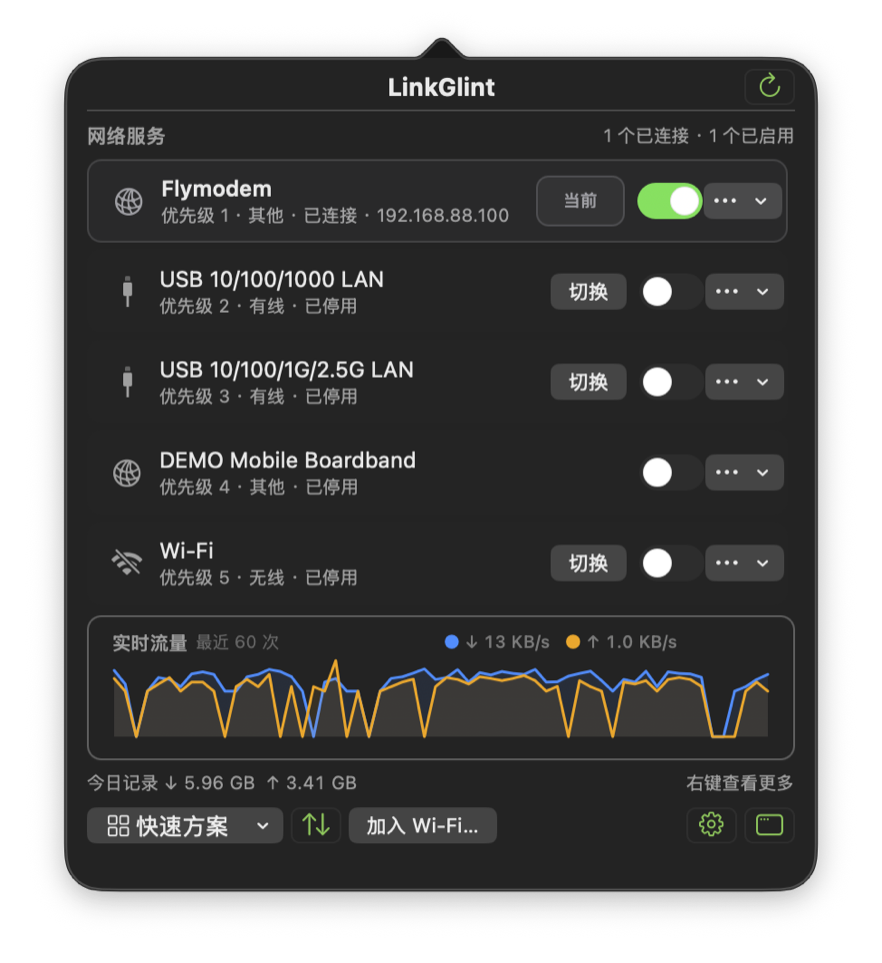

<p align="center">
  
</p>

<h1 align="center">LinkGlint</h1>

<p align="center"><strong>在 macOS 菜单栏查看连接、流量并管理网络优先级。</strong></p>

<p align="center">
  <a href="https://github.com/HarenaGodz/LinkGlint/releases/latest"></a>
  
  
  <a href="LICENSE"></a>
</p>

<p align="center">
  <a href="https://github.com/HarenaGodz/LinkGlint/releases/latest"><strong>下载最新版</strong></a>
  · <a href="CHANGELOG.md">更新日志</a>
  · <a href="docs/ARCHITECTURE.md">架构说明</a>
  · <a href="https://github.com/HarenaGodz/LinkGlint/issues">问题反馈</a>
</p>

<table>
  <tr>
    <td width="58%"></td>
    <td width="42%"></td>
  </tr>
</table>

LinkGlint 是一款轻量、原生的 macOS 菜单栏网络工具。

## 核心功能

- 显示当前网络、IP、实时上下行速度和最近 60 次流量曲线。
- 管理 Wi‑Fi、有线、移动宽带和系统 VPN，支持 IPv4 / IPv6、DNS 与服务优先级。
- 浏览并加入附近 Wi‑Fi，启停或切换网络服务。
- 保存常用网络方案，并在切换时保留备用链路。
- 支持登录启动、单/双行网速、Byte/bit 单位和三种上下行标记。

## 下载与安装

要求 macOS 13 Ventura 或更高版本，支持 Apple Silicon 与 Intel。前往
[GitHub Releases](https://github.com/HarenaGodz/LinkGlint/releases/latest) 下载 Universal 版本，解压后将 `LinkGlint.app` 拖入“应用程序”。若首次启动被拦截，请在访达中右击应用并选择“打开”。

单击菜单栏图标打开状态面板，右击打开完整菜单。关闭主窗口后应用仍会在菜单栏运行。

## 权限与隐私

| 权限 | 用途 |
| --- | --- |
| 定位服务 | 读取附近 Wi‑Fi 名称，不读取或上传坐标 |
| 管理员授权 | 安装受限助手，用于切换网络、修改 DNS 和优先级 |

Wi‑Fi 密码只交给 CoreWLAN。偏好、方案和用量记录仅保存在本机；项目不含账号系统或遥测 SDK。

## 从源码构建

需要 Xcode Command Line Tools 与 Swift 5.10：

```bash
git clone https://github.com/HarenaGodz/LinkGlint.git
cd LinkGlint
./build_app.sh
open dist/LinkGlint.app
```

运行测试、严格编译、打包与签名校验：

```bash
ARCHS="x86_64 arm64" ./scripts/verify.sh
```

实现细节见 [`docs/ARCHITECTURE.md`](docs/ARCHITECTURE.md)，版本变化见 [`CHANGELOG.md`](CHANGELOG.md)。欢迎提交 [Issue](https://github.com/HarenaGodz/LinkGlint/issues) 或 Pull Request。

## 许可证

[MIT License](LICENSE) · 由 **HarenaGodz（Harena）** 开发维护。
