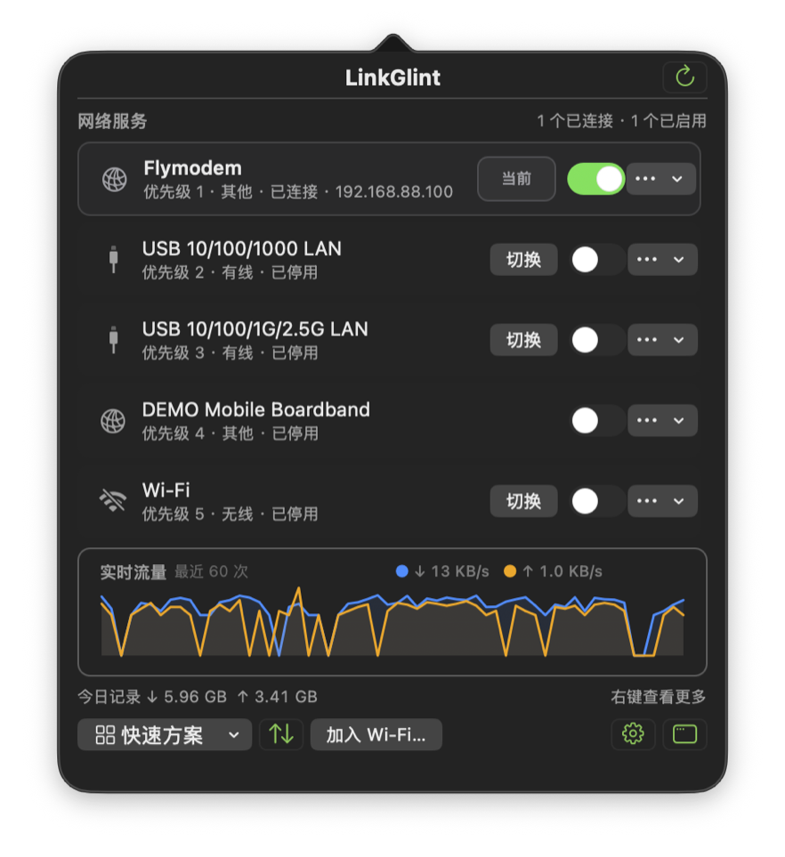

<p align="center">
  
</p>

<h1 align="center">LinkGlint</h1>

<p align="center"><strong>在 macOS 菜单栏查看连接、流量并管理网络优先级。</strong></p>

<p align="center">
  <a href="https://github.com/HarenaGodz/LinkGlint/releases/latest"></a>
  
  
  <a href="LICENSE"></a>
</p>

<p align="center">
  <a href="https://github.com/HarenaGodz/LinkGlint/releases/latest"><strong>下载最新版 DMG</strong></a>
  · <a href="CHANGELOG.md">更新日志</a>
  · <a href="docs/ARCHITECTURE.md">架构说明</a>
  · <a href="https://github.com/HarenaGodz/LinkGlint/issues">问题反馈</a>
</p>

<p align="center"></p>

LinkGlint 是一款轻量、原生的 macOS 菜单栏网络工具。

## 功能

- 显示当前网络、IP、实时上下行速度和最近 60 次流量曲线，并提供 7/30 天本地用量中心。
- 快捷面板显示出口 IP、内网 IP、地理位置、代理/TUN/出站路径和进程实时流量 TOP 5，并支持置顶。
- 管理 Wi‑Fi、有线、移动宽带和系统 VPN，支持 IPv4、IPv6、DNS 与服务优先级。
- 浏览并加入附近 Wi‑Fi，启停或切换网络服务。
- 保存网络方案，支持重命名、复制、应用前预览，切换时保留备用链路。
- 支持登录启动、菜单栏预览、显示预设、Byte/bit 单位，以及网关/DNS/外网/IPv6 网络诊断。

## 安装

1. 从 [GitHub Releases](https://github.com/HarenaGodz/LinkGlint/releases/latest) 下载 Universal DMG。
2. 打开 DMG，将 `LinkGlint` 拖到 `Applications` 文件夹。
3. 首次启动若被 macOS 拦截，在访达中右击 LinkGlint 并选择“打开”。

首次启动或权限失效时需要完成一次管理员授权，以安装仅接受预定义网络命令的受限组件。详细权限和第三方查询说明见 [`docs/PRIVACY.md`](docs/PRIVACY.md)。

## 从源码构建

需要 Xcode Command Line Tools 与 Swift 5.10：

```bash
./build_app.sh
swift test
./scripts/verify.sh
./scripts/package-dmg.sh
```

构建细节、测试、DMG 和 Release 检查清单见 [`docs/DEVELOPMENT.md`](docs/DEVELOPMENT.md)。

## 文档与许可证

- [`docs/ARCHITECTURE.md`](docs/ARCHITECTURE.md)：模块与数据流
- [`docs/PRIVACY.md`](docs/PRIVACY.md)：权限、网络查询和本地数据
- [`CHANGELOG.md`](CHANGELOG.md)：版本变化

[MIT License](LICENSE) · 由 **HarenaGodz（Harena）** 开发维护。
