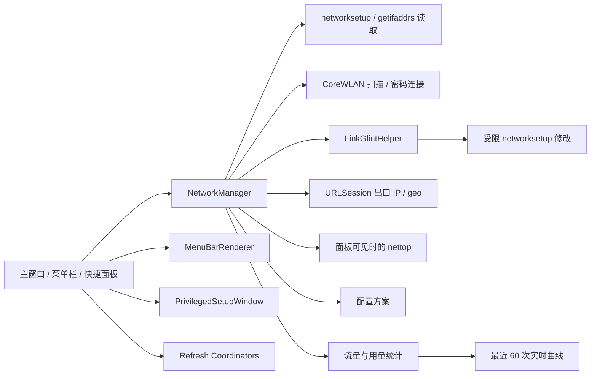

# LinkGlint 架构

## 目录

```text
LinkGlint/
├── LICENSE                         # MIT 开源许可证
├── Resources/App/                  # Info.plist 与应用图标
├── Resources/DMG/                  # DMG 背景源图
├── scripts/                        # 构建、验证、背景渲染与 DMG
├── Sources/LinkGlint/              # 按子系统组织的应用代码
├── Sources/LinkGlintHelper/        # 受限的本机权限助手
├── Sources/LinkGlintHelperSupport/ # 助手参数校验（可单测）
├── Tests/LinkGlintTests/           # 按子系统组织的单元测试
├── build_app.sh                    # 兼容构建入口
└── Package.swift                   # Swift Package 清单
```

## 运行结构


```mermaid
flowchart LR
    UI[主窗口 / 菜单栏 / 快捷面板] --> Manager[NetworkManager]
    UI --> Renderer[MenuBarRenderer]
    UI --> Setup[PrivilegedSetupWindow]
    UI --> Refresh[Refresh Coordinators]
    Manager --> Read[networksetup / getifaddrs 读取]
    Manager --> WLAN[CoreWLAN 扫描 / 密码连接]
    Manager --> Helper[LinkGlintHelper]
    Manager --> Egress[URLSession 出口 IP / geo]
    Manager --> Process[面板可见时的 nettop]
    Helper --> Write[受限 networksetup 修改]
    Manager --> Profiles[配置方案]
    Manager --> Usage[流量与用量统计]
    Usage --> Chart[最近 60 次实时曲线]
```

主应用负责展示状态、读取系统网络信息和组织用户操作。需要修改网络设置时，
主应用通过 `sudo -n` 调用首次配置阶段安装的受限助手。助手只接受代码中定义的
网络操作，不接收任意可执行文件路径或 Shell 命令。

未完成管理员授权前，覆盖式配置窗会拦截快捷面板、主窗口、偏好设置与网络写操作；
菜单栏速率与图标仍可更新，用户只能完成授权或退出应用。

`MenuBarRenderer` 集中处理单双行布局、固定速率列宽、明暗外观、状态语义颜色与
偏好设置预览。渲染器只识别格式化后的速率片段，不会把 SSID 或服务名中的方向字符
误当成流量标记。面板打开或置顶时菜单栏速率继续刷新。

`StatusPanelLayout` 负责快捷面板中行流量/出口 IP 卡片几何；出口 IP 与地理位置查询
与流量采样解耦，并按面板开关节流。

快捷面板还包含只读的 `ProxyPathSnapshot`：系统代理来自 macOS 的代理设置，TUN
来自已检测到的可路由 utun/ppp/tun 接口，内网 IP 来自活动物理接口；Clash 出站模式
仅在面板打开时向本机常见 controller 端口的 `/configs` 发起短超时 GET。控制端口未
开放、启用密钥或 Clash 未运行时显示“模式未知/未检测到 Clash”，不会根据公网 IP 猜测规则模式，
也不会向 Clash 写入配置。

## 刷新与响应性

- 网络路径变化使用 600 毫秒防抖，避免接口切换期间反复重建界面。
- 各网络服务的只读详情最多并行读取 4 项，完成后仍按 macOS 服务优先级排序。
- 实时流量通过 `NET_RT_IFLIST2` 读取原生 64 位接口计数器，不为每次采样启动子进程，也不会在 4 GiB 后回绕。
- 状态栏与流量定时器加入主运行循环的 common mode，菜单操作期间也能继续采样。
- 面板关闭后仅保留轻量采样历史，不再更新不可见的 AppKit 曲线视图。
- 重复刷新请求和 Wi-Fi 扫描请求会合并；系统命令、扫描等待与目标链路就绪检查都有明确上限。
- 读取失败时继续展示最后可信快照并标记为可能过期，不会用半成品状态覆盖界面。
- 快捷面板的网络检测复用后台诊断结果，显示默认路由、网关延迟和 DNS 状态；连接摘要复制只读取本地快照，不上传数据。
- 快捷面板可置顶，并展示合并的公网/内网 IP 信息、出口地理位置、紧凑的代理路径摘要和进程流量 TOP 5；进程采样仍只在面板可见时运行。
- Wi-Fi 名称的瞬时读取失败会在短时限内复用最近可信 SSID；明确断开、关闭无线或缓存到期会立即清除。
- 权限助手状态使用单调时钟短期缓存，并以 generation 阻止失效中的旧解析回写；安装、移除和缓存失效后的状态解析均在后台执行。
- 权限配置窗在同一次引导期间不会因定期刷新而反复居中抢焦点。

## 网络修改可靠性

- 普通“切换”先启用目标链路并等待可用地址，再提高其服务优先级；原有链路保留为自动回退。
- 配置方案按“打开无线 → 启用服务 → 验证目标就绪 → 停用旧服务/无线”的顺序执行。
- 助手在修改前记录服务与无线电状态；命令失败、超时或目标未就绪时按反向顺序尽力回滚。
- 助手协议只接收固定操作与经过校验的名称、设备和地址，不执行来自界面的 Shell 片段。
- CoreWLAN 扫描和 Wi-Fi 关联通过进程级门控串行化；密码仅传给 CoreWLAN，不进入命令参数。

## 已知限制

- 修改网络需要一次管理员授权安装受限助手；未授权时只读菜单栏监视仍可用。
- 读取附近 Wi‑Fi 名称依赖定位服务；不读取或上传坐标。
- 出口 IP / 地理位置会向 Cloudflare、ipify、icanhazip、geojs、ipinfo 发起短超时查询；失败时面板显示“不可用”。
- 进程流量依赖 `/usr/bin/nettop`，在高负载或权限受限时可能短暂为空。
- 不使用 SMJobBless/XPC；助手安装走管理员 AppleScript + sudoers 白名单。

## 应用生命周期

- 显示主窗口或偏好设置时使用标准应用模式，因此窗口可正常出现在 Dock 与应用切换器中。
- 关闭最后一个窗口后切换为辅助应用模式，Dock 图标消失，但状态栏项目、网络监视和定时器继续运行。
- 从状态栏选择“显示主窗口”或重新打开应用时恢复标准应用模式。
- 登录时启动由 `SMAppService` 管理，与用于修改网络配置的 root 助手相互独立。

## NetBar 升级兼容

LinkGlint 保留 `local.codex.NetBar` Bundle ID 和状态栏位置标识，以继承 3.x 用户的
偏好设置、登录项批准与菜单栏位置。权限管理器优先使用新的 LinkGlint 助手，同时兼容
读取旧的 `local.codex.NetBarHelper`；用户可在偏好设置中一次性移除新旧两套配置。
